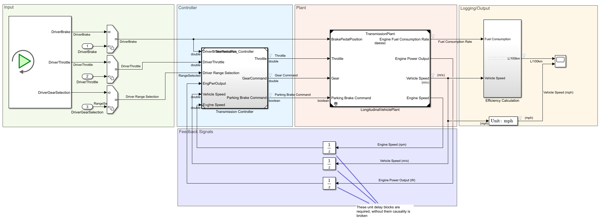
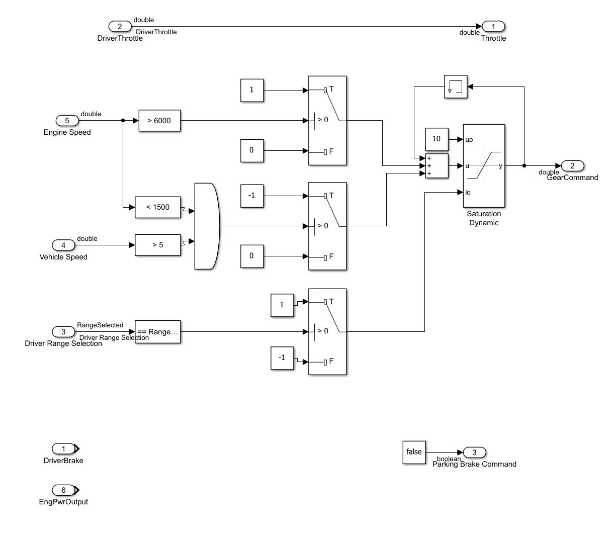
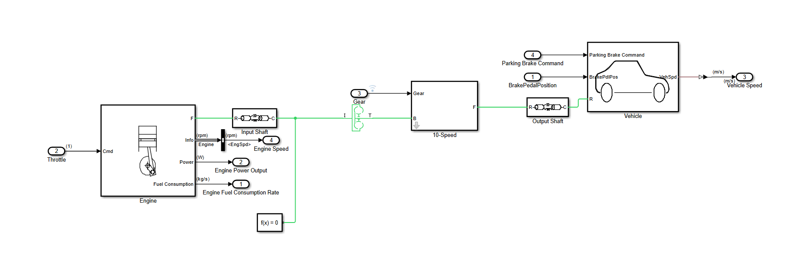
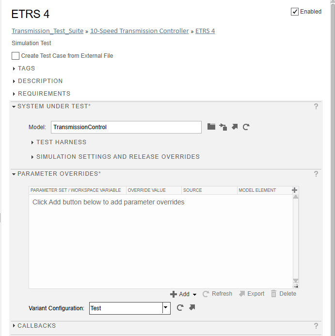
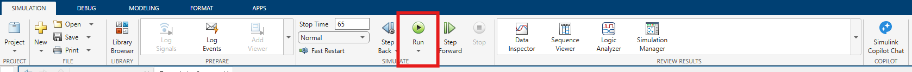
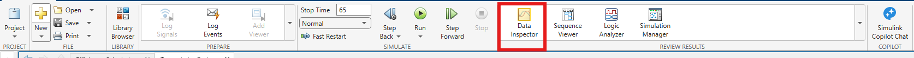
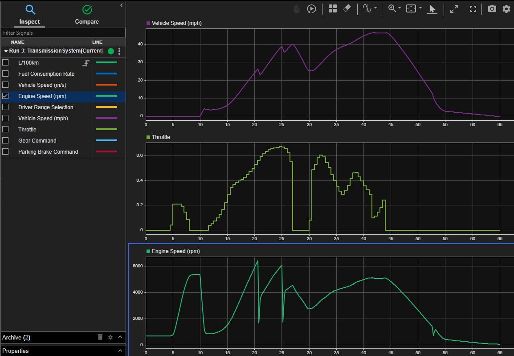

# 1. Installing MATLAB
1. Go to the [MathWorks downloads page](https://www.mathworks.com/downloads/) (You may have to sign in, use your McMaster email and password)
2. Download R2026a for your operating system
3. Using the installer you just downloaded, open it and follow the install process, when you get to the PRODUCTS tab you will need to select the following: MATLAB, Simulink, Simulink Test, Requirements Toolbox, Stateflow, Simscape, Simscape Driveline, Powertrain Blockset, Parallel Computing Toolbox, and Vehicle Dynamics Blockset.

# 2. Forking the Development Challenge Repository
To ensure each team has its own copy of the challenge, one member of your team will create a fork of the repository. A fork is a copy of a repository that exists under your own GitHub account, allowing your team to make changes without affecting the original challenge repository. 
## 2.1. Create a GitHub Account
If you do not already have a GitHub account:
1. Select Sign Up in the top right corner of this page.
2. Create an account using your McMaster email address if possible.
3. Verify your email address and complete the account setup process.
## 2.2. Fork the Repository
1. Navigate to the PCM Development Challenge repository homepage:
    - https://github.com/sticklat/PCM-Dev-Challenge_EIC-Y1
2. In the upper-right corner of the repository page, click Fork.
3. Select your GitHub account as the destination.
4. Wait a few moments while GitHub creates your personal copy of the repository.
## 2.3. Add Team Members
If you are working in a group:
1. Open your forked repository.
2. Navigate to Settings $\rightarrow$ Collaborators and teams.
3. Select Add people.
4. Invite each member of your team using their GitHub username or email address.
5. Ensure all team members accept their invitation before beginning development.
## 2.4. Clone the Repository to Your Computer
Once the repository has been forked, download (clone) a local copy to your computer.
1. Open your forked repository on GitHub.
2. Select the green Code button.
3. Copy the HTTPS repository URL.
4. Open a terminal, Git Bash, or command prompt.
5. Run: git clone \<repository URL> (replace \<repository URL> with the URL you copied in step 3)
6. Navigate to the repository: cd PCM-Dev-Challenge_EIC-Y1 (or the name of your forked repository if you renamed it)
## 2.5 Open the Repository in MATLAB
1. Open MATLAB.
2. Select Browse for folder, navigate to the folder where you cloned the repository, and select open.
3. Double click on the `PCM-Dev-Challenge_EIC-Y1.prj` file to open the project in MATLAB.

# 3. Introduction to the Provided Files + Models
Below is a brief introduction to the files and models that have been provided to you for the challenge. 

## 3.1. Models
This is where all the simulink models are stored, there are three in total.
- `TransmissionSystem.slx`: The main model that you will be using, this contains the input, output and signal routing. This model also contains the plant and the controller, however only as referenced models (meaning they are just pointers to external model files).
- `TransmissionPlant.slxp`: The plant model, which models the behaviour of the combustion engine, torque converter, 10-speed transmission, and longitudinal vehicle. This file has been provided in a read-only format as you will not be needing/allowed to edit this during the challenge.
- `TransmissionController.slx`: The controller model, which has been provided containing a basic controller that you will be modifying and improving during the challenge. 

### 3.1.1. TransmissionSystem.slx

- **Inputs:** This is where the three inputs to the system are located, these are the throttle position, brake pedal position, and driver gear selection. The switchs are used to switch between when running the model in simulation mode and when running the model in test mode. In simulation mode the replay block is used to replay the input file `ETRS_DriverLog.mat` which contains a very basic set of inputs that can be used for some basic testing. In test mode the inputs are taken from the inports, which replay them from the input file selected in the test case.
- **Controller:** This is where the controller model that you will be modifying is located, this is a referenced model and can be opened by double clicking on it. 
- **Plant:** This is where the plant model is located, you cannot modify this model as it is provided in a read-only format, however you can double-click to open it to view the model and see how it works.
- **Logging/Output:** This is where the efficiency calculation and vehicle speed conversion happens. There is a scope connected to these signals but it is suggested to use the data explorer to view the signals as it is much easier to use and allows for more functionality. The data explorer can be opened by clicking on the data explorer button in the *Review Results* section of the *Simulation* tab.
- **Feedback Signals:** These are the signals that are fed back to the controller, these are the vehicle speed, engine speed, and engine power ouput. You can choose to use as many or as few of these signals as you want in your controller, whatever you find works best for your design.
### 3.1.2. TransmissionController.slx

You have been provided with a basic controller that you will be modifying and improving during the challenge. The controller functions on a simple principle of shifting up when the engine reaches 6000 RPM and shifts down when the engine reaches 1500 RPM. 

This is enough such that the TransmissionSystem model will run and produce output, however it is not a very good controller and will not produce good results or pass test cases. You will need to improve this controller to achieve better results.

#### 3.1.2.1.Controller Inputs
- **DriverBrakePedalPosition:** This is the position of the brake pedal, it is a value between 0 and 1 where 0 is no braking and 1 is full braking.
- **DriverThrottle:** This is the position of the throttle, it is a value between 0 and 1 where 0 is no acceleration and 1 is full acceleration.
- **Driver Range Selection:** This is the gear that the driver has selected, it is an enumerated value where:
    - 0 = RangeSelected.Reverse
    - 1 = RangeSelected.Neutral
    - 2 = RangeSelected.Park
    - 3 = RangeSelected.Drive

#### 3.1.2.2.Controller Outputs
- **Throttle:** This is the throttle command that is sent to the plant, it is a value between 0 and 1 where 0 is no acceleration and 1 is full acceleration.
- **GearCommand:** This is the gear command that is sent to the plant, it is an enumerated value where -1 is reverse, 0 is neutral, and 1-10 are the forward gears.
- **Parking Brake Command:** This is the parking brake command that is sent to the plant, it is a boolean value where 0 is no parking brake and 1 is full parking brake.

### 3.1.3. TransmissionPlant.slxp

You don't need to understand exactly how this model works, but in general it models the physical connections from the engine to the wheels, including the torque converter and transmission. The model takes in the throttle position, brake pedal position, and driver gear selection as inputs and produces the vehicle speed, engine speed, and engine power output as outputs.

Throttle command $\rightarrow$ Engine $\rightarrow$ Torque Converter $\rightarrow$ Transmission $\rightarrow$ Rear Axle $\rightarrow$ Wheels

#### 3.1.3.1. Plant Inputs
- **BrakePedalPosition:** This is the position of the brake pedal, it is a value between 0 and 1 where 0 is no braking and 1 is full braking.
- **Throttle:** This is the throttle command that is sent to the plant, it is a value between 0 and 1 where 0 is no acceleration and 1 is full acceleration.
- **Gear:** This is the gear command that is sent to the plant, it is an enumerated value where -1 is reverse, 0 is neutral, and 1-10 are the forward gears.

#### 3.1.3.2. Plant Outputs
- **Engine Fuel Consumption Rate:** This is the rate at which fuel is being consumed by the engine, it is a value in kg/s.
- **Engine Power Output:** This is the power output of the engine, it is a value in Watts.
- **Vehicle Speed:** This is the speed of the vehicle, it is a value in m/s.
- **Engine Speed:** This is the speed of the engine, it is a value in RPM.

## 3.2. InputFiles
You have been provided with 2 example input files that can be used to test your controller, these are located in the InputFiles folder. The input files are in .mat format and contain a structure with the following fields:
- **DriverThrottle:** This is the position of the throttle, it is a value between 0 and 1 where 0 is no acceleration and 1 is full acceleration.
- **DriverBrake:** This is the position of the brake pedal, it is a value between 0 and 1 where 0 is no braking and 1 is full braking.
- **DriverRangeSelection:** This is the gear that the driver has selected, it is an enumerated value where:
    - 0 = RangeSelected.Reverse
    - 1 = RangeSelected.Neutral
    - 2 = RangeSelected.Park
    - 3 = RangeSelected.Drive

## 3.3. Requirements_Testing
Refer to the [RequirementsAndTesting](RequirementsAndTesting.md) guide for instructions on how to add requirements and test cases to the provided files.

### 3.3.1. Requirements
Located in the Requirements_Testing folder is a file called `Transmission_Requirements.slreqx`, this file contains 4 example requirements to get you started. You will need to add your own requirements to this file as you review and add to the system specifications.

### 3.3.2. Test Cases
Located in the Requirements_Testing folder is a file called `Transmission_Test_Suite.mldatx`, this file contains 2 example test cases to get you started. You will need to add your own test cases to this file as when you get to the testing phase of the challenge. The test cases are linked to the requirements in the `Transmission_Requirements.slreqx` file, so when you add your own requirements you will need to add your own test cases as well.

**Note:** For when you are wanting for your test cases to use input other than the  `ETRS_DriverLog.mat` that comes from the replay block, you will need to go to the **PARAMETER OVERRIDES** section of the test case and change the variant Configuration to **Test** and then select the input file you want to use in the **Input File** parameter. This will allow you to use any of the input files that are located in the InputFiles folder.

## 3.4. Guides
- [DevEnvironmentSetup](DevEnvironmentSetup.md): This guide, which you are currently reading, contains instructions on how to set up your development environment and an introduction to the provided files and models.
- [RequirementsAndTesting](RequirementsAndTesting.md): This guide contains instructions on how to add requirements and test cases to the provided files.

# 4. Running the Model

Once you have the project open in MATLAB, you can run the model by opening the `TransmissionSystem.slx` file and clicking the Run button in the Simulink toolbar. This will run the simulation using the default input file `ETRS_DriverLog.mat`. 
 

Once the simulation is complete, you will see that the Data Inspector icon has been highlighted. If you click on it you can view the results of the simulation by selecting the signals you want to view in the left panel. Learn more about how to use the data inspector [here](https://www.mathworks.com/help/simulink/slref/simulationdatainspector.html).

