# 1. Requirements Toolbox  
To start bringing your requirements into the Simulink model environment, you will need to open the provided feature model. Once the Simulink model has opened, you will want to navigate to the ‘Apps’ tab of the top toolbar on the screen. In the Apps tab of the top bar, use the dropdown to open the full App list, and find the highlighted app in the image below:  
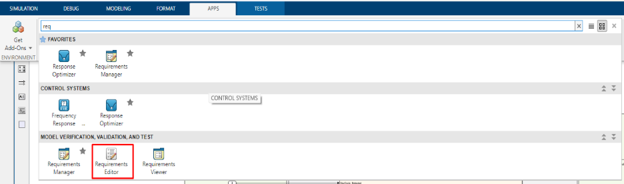

This will open the requirements editor app window.  
To open the requirements file, select the button in the top banner ‘Open’. This will open up your File Directory, prompting you to search for the relevant requirements file (`.slreqx`). If your requirement set ever needs to be updated, you can re-open your existing requirement set and make the necessary changes. 

Once you have opened your requirement set, you are ready to start adding your requirements for tracking. In the requirements editor window, you can add requirements by right-clicking the set at the top of the index and choosing “Add Requirement”.  
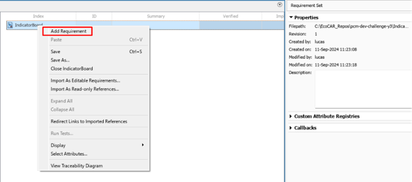

You can also add child requirements to a container requirement. In the requirements editor window, you can add child requirements by right clicking the container requirement at the top of the index and choosing “Add Child Requirement”.  

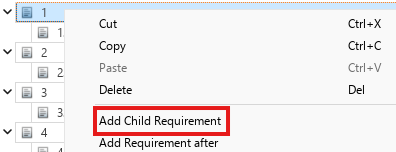

Once your requirement has been added, you can modify the relevant fields (Custom ID, Summary, Description). Your summary and description can be identical. Your custom ID should follow the form of \<Abbreviated Feature Name> \<Number>, i.e. IB 1, IB 2, etc for the Indicator Board feature.  
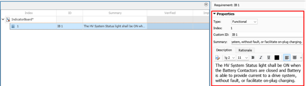

## 1.1. Linking Requirements to Implementations Within your Model 
Once you have a completed model revision available, you can create a link within the requirements editor that connects a given requirement to the pieces of code that enforce it. To do so, you need to select the block(s), Stateflow state(s), or Stateflow transition(s), and then within the requirements editor, right-click the specific requirement and choose “Link from \<selection>”. An example of this is shown below:  
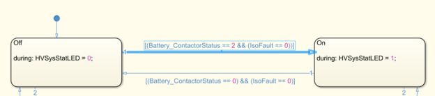
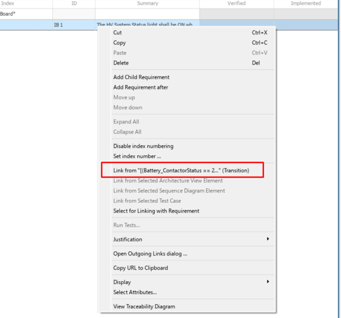
 

## 1.2. Linking Requirements to Test Cases  
Once you have a completed test created within your Simulink Test Manager test suite, you will be able to link your requirement to the test. To do so, you will need to first open the Simulink Test Manager window and select the test which you will link by clicking on it.  
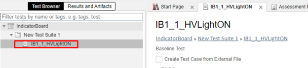

Then, you will need to move to requirements editor window and right-click the requirement you would like to link. Similar to linking for implementation, you will select the option “Link from Selected Test Case” from the right-click menu. An example of this is shown below:  
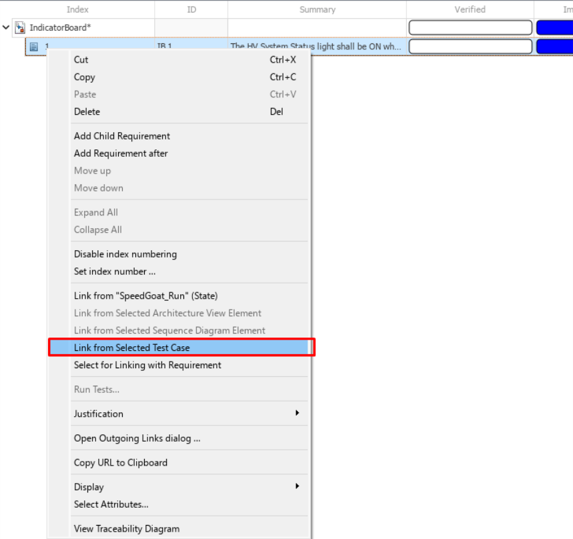

# 2. Simulink Test Manager  
Open the Simulink Test Manager either by typing the command sltest.testmanager.view in the MATLAB command window, or by opening your Simulink model and navigating to the Apps tab of the top banner. In the Apps tab of the top bar, use the dropdown to open the full App list, and find the highlighted app in the image below:  

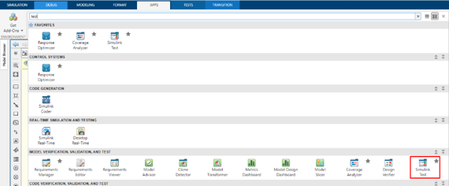 

Selecting the app or running the command will open the Simulink Test Manager Window, shown below.  
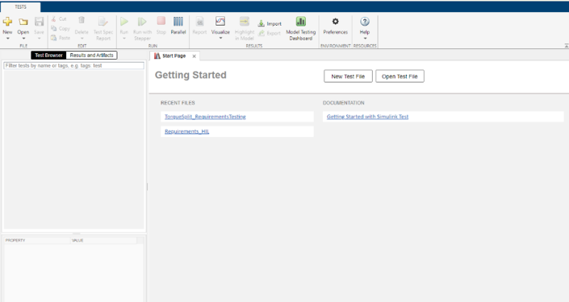

Test files contain test suites and test suites contain individual tests. The current file structure is that we have a test file for each module under testing which has one test suite containing all tests for all requirements defined for the feature.  

## 2.1. Creating your Simulink Tests  
To make a new Test file: New → Test File  
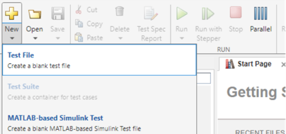

To make a new Test Suite (not necessary for dev challenge): Right click your test file, New → Test Suite  
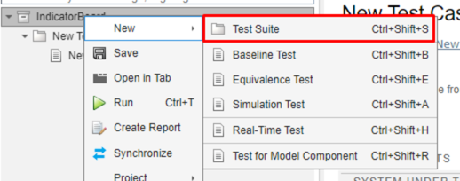

To make a new Test: Right click your test file, New → Baseline Test  
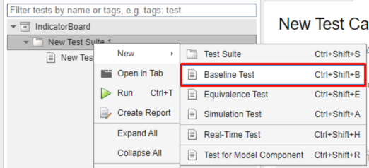

Note: When creating a new test, use the naming scheme \<feature ID>\<requirement number>-\<test number>_<test name>. e.g. IB1_1_HVLightON  

## 2.2. Configuring the System Under Test  
Select the model that you want to test, make sure to set Simulation Mode to Normal and check the boxes that say start and stop time with however long your test is. If you don’t, the test may not stop running and it’s a hassle to deal with… Also make sure that the model is in your path when you try to run the test or else it won’t know where it is.  
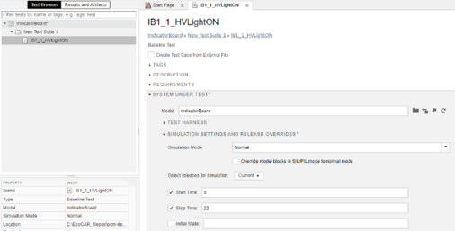

## 2.3. Creating Inputs  
The inputs are all the signals that go into your model. Your job is to fake them to make the system think it’s under a certain scenario. To create your test inputs, navigate to the INPUTS dropdown of your newly created test. If you already have a file containing all the input signals, you can hit Add. If not, you can hit Create.  
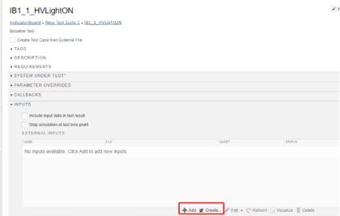
Naming convention for input files:  
\<System>_in_r\<Requirement Number>_test\<Test Number>.mat  
e.g. IB_in_r1_test1.mat  
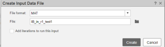
    
Once your input file is created, a signal editor window will be opened.  
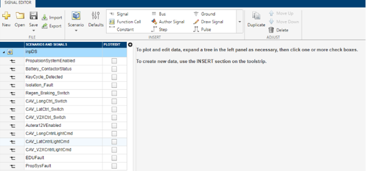

Click the Plot/edit checkbox to view the signal. By default, it should be 0 for 10 seconds. Make any changes you need to by adding new rows and specifying the value of that signal at that time. It fills in gaps linearly so if you are making a digital signal, you will need to specify the value of the signal just before the change and just after (4.999 → 5 seconds). Alternatively, you can set both the pre-change and post-change to the same time value (5 → 5 seconds).  
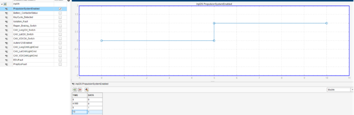

Click Apply to see your signal plot over time, then save the file when you are done editing all signals. Before moving on, ensure the status bar says “Mapped”. If not, click on the “Not mapped” link and it should give you a pop-up where you can map it. This is tedious for the first test, but you can re-use these test files for future tests and only change the signals you need to, so it becomes less annoying.  

## 2.4. Creating Baseline Data  
If you know your model works as it is, you can create baseline data by running the model with the inputs created in the previous step. To create baseline data for your test, navigate to the BASELINE CRITERIA dropdown of your created test. Hit Capture and choose a file to save your baseline data by typing the name, the same way as with inputs. You can also hit Add if you already have pre-recorded data and don’t need to re-create the data.  
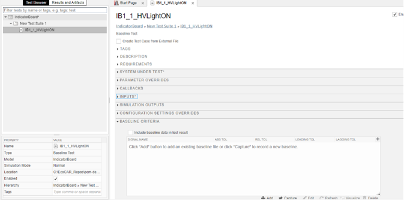

The test will then compare this baseline data with the outputs of the model it runs. That way, if anything has changed that has affected the outputs of the model, it will flag it and fail the test.  
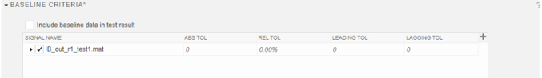

Suggested naming convention for baseline data files:  
\<System>_out_r\<Requirement Number>_test\<Test Number>.mat eg. IB_out_r1_test1.mat  

## 2.5. Logical and Temporal Assessments  
If your test is expected to change behaviour upon a certain trigger, you can test that here. For example, requirements tests would be evaluated using logical and temporal assessments. To create your assessments for the tests, navigate to the **LOGICAL AND TEMPORAL ASSESSMENTS** dropdown of your created test.  
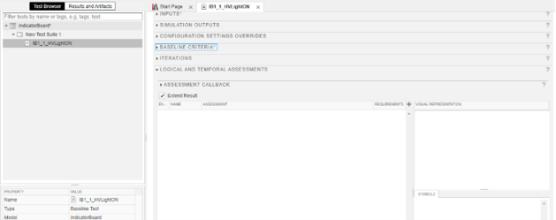

The menu here is pretty self-explanatory, it is similar to a stateflow condition with some extra steps. To create an assessment, scroll down and find the Add Assessment button.  
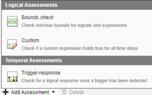

Typically, requirements assessments would fall under the ‘Custom’ option, or the ‘Trigger-Response’ option. An example of a trigger-response assessment is shown below for the indicator board:  
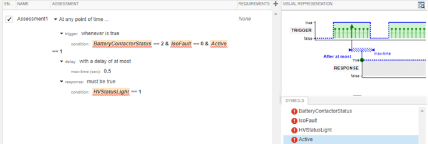

The only unintuitive thing is that in order to link up variable’s names in your expressions here with the correct signals in your model, you have to hover over the name of the signal in the Symbols tab and hit the three bars. Click “Map to model element”. This will open the Simulink view of the model under test. Here, you can select the signal line that corresponds to the variable within the test, shown below:  
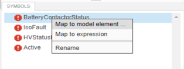

Once selected, be sure to hit ‘Done’ in the test manager window. You will need to do this for all variables in all assessments in order for all assessments to successfully run and evaluate.  
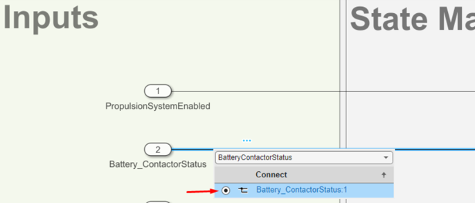

## 2.6. Running your Tests and Assessments  
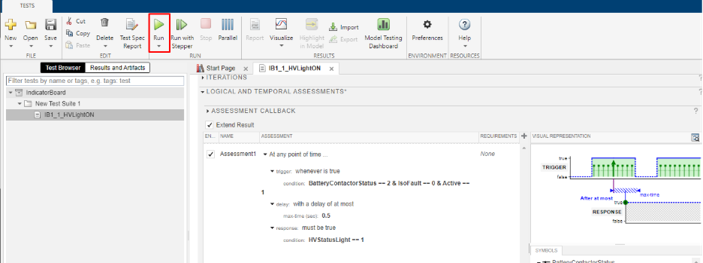

Hit run while highlighting a test to test that individual test or while highlighting a test suite/file to test all tests contained in that structure. Always to be sure to check if your Logical and Temporal Assessments get tested (it should have a check mark next to it instead of an orange don’t sign). The test can still pass if you set up the inputs or the conditions wrong, thus making the test meaningless.  
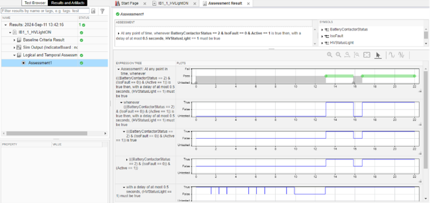

And that’s it! Make sure to save and know that when you make the first initial test, you can copy the entire test to save you time for future ones.  
# 3. Closing Remarks  
If you have any questions or need support with any of these steps, do not hesitate to reach out for support. You can contact Thomas (sticklat@mcmaster.ca), Ahmed (zabtiaa@mcmaster.ca) or use the PCM Development Challenge channel on Teams for support or to check in.

